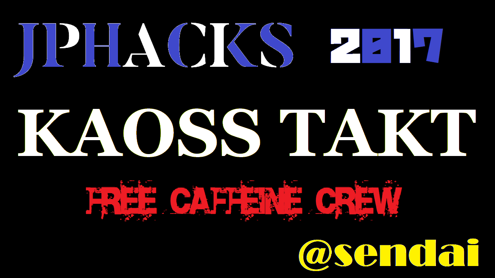

# KAOSS TAKT
↓クリックしたらYoutubeのリンクに飛びます

## 製品概要
### DJ x Tech♪♪

### 背景（製品開発のきっかけ、課題等）

ちょうど深夜一時のナイトクラブを想像してほしい．　　

DJがベースの効いた音楽をフロアにドロップする．　　

爆音がフロアを満たす中，DJもオーディエンスもリズムの身を任せて飛び跳ね，フロアとDJブースの一体感が最高潮に達する．　　　

ここで，DJがエフェクターを曲にかけようとするとしよう．　　

彼/彼女は、フロアから視線を下げてDJミキサーのエフェクターに集中しなければならない．　　

これではエフェクターをかけるときに必然的に会場の一体感は途切れてしまう！　　

この問題を解決するために，今回は加速度センサーを利用してDJブースの上に仮想的なエフェクターをつくる．　　

### 製品説明（具体的な製品の説明）

* 本デバイスはDJをしながらパフォーマンスを行うことができるデバイスである．
* パフォーマンスを行った際に，アンドロイド端末で取得した加速度やジャイロのデータを利用して，曲のフィルタ周波数の値を変化させる．
* フィルタ周波数の変化の調整は，実際にクラブやバーでDJを行っているメンバーの経験をもとに調整した．

### 特長

#### 1. 機能1

ジャイロセンサを感知することで，曲のハイパス/ローパスフィルタをダイナミックに操作できる。

#### 2. 機能2
加速度センサのX,Y,Zの三軸にSEを割り当てることで，それぞれの軸の加速度を感知した時に対応するSEを鳴らせる

#### 3. 機能3
アプリに実装したボタンによって楽曲の変更ができる

### 解決出来ること
今まではエフェクターをDJミキサーからかけていたため、エフェクターをかけるためにDJミキサーに注意を向けなければいけなかった．

KAOSS TAKTはDJをイメージしたアプリケーションである。空間全体をエフェクターとして使用するため、DJとして新しい機能を持っていることになる。これにより観客、会場との一体感を損なうことなく音楽をかけられる体験ができる。

また，エフェクトをダイナミックな動きでかけることができるようになるため，オーディエンスに対してよりアピーリングなパフォーマンスが可能になる．

### 今後の展望

* 複数台の端末でパフォーマンスを行ったときに曲が変化するようにし，会場全体の盛り上がりを音楽やエフェクトに反映できるようにすることで、「体験の共有」を支援するようなデバイスをつくりたい．具体的にはWebSocketやskywayで複数の端末からのデータをunityで処理して送る，といったことを考えている．
* パフォーマンスをしたときに観客が反応するといった要素をVRで実装し，「いかにパフォーマンスをして，観客を盛り上げるか」といった対戦要素を持ったゲーム機能をつけたい
* Vidoe Jockeyなどの視覚的なパフォーマンスのコントローラーとしても使えるようにしたい。
* 他には曲のチューニングの幅を増やしたり，別々の曲を組み合わせるといった機能を付加したい。

また，余談だが本来のアイディアは
「曲のポーカルやドラムを自由に抜いたり組み合わせたりして，新しい楽曲を作成するシステム」を作成しようとしていた
（1日目の17時に路線変更．NECの方に質問しまくりました．対応して下さり誠に感謝しております）
これらを連携させて，総合的なパフォーマンスアプリケーションにしたい．

## 開発内容・開発技術
### 活用した技術
#### 使用言語
* C#

#### フレームワーク・ライブラリ・モジュール
* Unity
* Android Studio
* Unityアセットストア

#### デバイス
* Android

### SE
* 音人 https://on-jin.com/sound/ta.php?kate=%E6%A5%BD%E5%99%A8%E7%B3%BB
* くらげ工匠 http://www.kurage-kosho.info/others.html
* ニコニコモンズ　http://commons.nicovideo.jp/material/agreement
* d-elf.com https://www.d-elf.com/free-bgm
* いいぞ！もっとやれ！ノリノリなハッピーハードコア - ys169　https://www.youtube.com/watch?v=5PY8qHqUb8E
* 甘茶の音楽工房　http://amachamusic.chagasi.com/image_oshare.html 
* うっちーゼロ　https://www.youtube.com/watch?v=Vs0kZAGEMlI

### 研究内容・事前開発プロダクト（任意）
最初はpythonで音の制御をしようとしており，以下のサイトを参考にして，音声信号処理の練習をしていた．
http://aidiary.hatenablog.com/entry/20110514/1305377659

### 独自開発技術（Hack Dayで開発したもの）
#### 2日間に開発した独自の機能・技術
* Unityでセンサ情報を獲得
* センサ情報をもとに音のフィルタ周波数を変更
* 加速度をもとにしたパフォーマンスのアルゴリズムを作成
* パフォーマンスのアルゴリズムをC＃で実装

